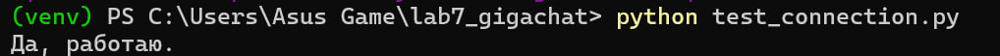
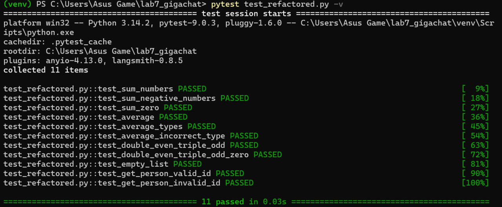

# Отчет по лабораторной работе 16. 

**Дата:** 16-05-2026
**Семестр:** 2 курс 2 полугодие – 4 семестр
**Группа:** ПИН-б-о-24-1
**Дисциплина:** Технологии программирования
**Студент:** Лаврентьев Аврам Петрович

## Цель работы
Получить практические навыки работы с отечественным ИИ-ассистентом GigaChat: генерация функций на Python по текстовому описанию, рефакторинг существующего кода, написание тестов и документации, критический анализ сгенерированного кода.
## Теоретическая часть

GigaChat — это нейросетевая модель от Сбера, способная генерировать текст, отвечать на вопросы, писать программный код. В лабораторной работе использовалось API GigaChat (библиотека gigachat для Python) для автоматизации задач разработчика:
- Генерация кода по текстовому описанию с требованиями к стилю (аннотации типов, docstring, обработка ошибок).
- Рефакторинг «плохого» кода: улучшение читаемости, добавление типов, переименование переменных.
- Генерация тестов (pytest) для проверки функциональности.
- Анализ кода с выявлением проблем качества, читаемости, безопасности, производительности.
- Генерация документации (README, docstring).
Качество результатов сильно зависит от промпта — чем точнее описание, тем лучше код. Однако ИИ может допускать ошибки (пропуск импортов, некорректные имена), поэтому требуется ручная проверка.
## Практическая часть

### Выполненные задачи
1)Регистрация и настройка доступа к GigaChat API
- Зарегистрирован аккаунт физического лица на developers.sber.ru.
- Получен Client Secret, создан файл .env с переменными GIGACHAT_CREDENTIALS и GIGACHAT_VERIFY_SSL_CERTS=False.
- Установлены библиотеки: gigachat, python-dotenv, pytest.

2)Разработка класса GigaChatAssistant
- Реализованы методы: generate_code, refactor_code, generate_tests, generate_documentation, analyze_code, chat.
- Добавлена очистка ответов от markdown-разметки.
- Код протестирован на подключении к API (тест test_connection.py).

3)Генерация трёх функций по текстовому описанию
- validate_email — валидация email через регулярное выражение.
- sort_by_key — сортировка списка словарей по ключу.
- Декоратор timer — измерение времени выполнения функции.

4)Рефакторинг «плохого» кода (bad_code.py)
- Переименованы функции и переменные в осмысленные имена.
- Добавлены аннотации типов и docstring.
- Глобальная переменная заменена на константу.
- Добавлена обработка ошибок в функции получения пользователя.

5)Генерация и запуск тестов
- Сгенерированы тесты на pytest для отрефакторенного кода.
- После небольшой корректировки (уточнение промпта) тесты успешно запущены, все 11 тестов пройдены.

6)Анализ сгенерированного кода и создание документации
- Проведён анализ трёх функций (выявлены потенциальные проблемы).
- Сгенерирован README-файл с описанием проекта, установкой и примерами.
### Ключевые фрагменты кода

**Инициализация клиента GigaChat**
```python
self.client = GigaChat(
    credentials=self.credentials,
    model=self.model,
    verify_ssl_certs=self.verify_ssl
)
```

**Генерация кода с очисткой markdown**
```python
def generate_code(self, description: str, language: str = "python") -> str:
    prompt = f"..."
    response = self.client.chat(prompt)
    code = response.choices[0].message.content
    if code.startswith("```"):
        code = code.split("```")[1]
        if code.startswith(language):
            code = code[len(language):]
        code = code.strip()
    return code
```
**Пример сгенерированной функции (валидация email)**
```python
import re

def validate_email(email: str) -> bool:
    pattern = r'^[a-zA-Z0-9._-]+@[a-zA-Z0-9.-]+\.[a-zA-Z]{2,}$'
    try:
        if not isinstance(email, str):
            raise TypeError("Параметр 'email' должен быть строкой.")
        if len(email.strip()) == 0:
            return False
        return bool(re.match(pattern, email))
    except Exception as e:
        print(f"Ошибка проверки email: {e}")
        return False
```
## Результаты выполнения

### Подключение к GigaChat API
Успешный ответ на тестовый запрос test_connection.py:
```bash
Да работаю.
```

### Генерация функций
Сгенерированный код функций (generated_code.py) содержит корректные реализации с аннотациями типов и docstring. Пример для декоратора timer:
```python
from typing import Callable, Any
import time
from functools import wraps

def timer(func: Callable) -> Callable:
    @wraps(func)
    def wrapper(*args, **kwargs):
        start = time.time()
        result = func(*args, **kwargs)
        print(f"Время: {time.time()-start:.4f} сек")
        return result
    return wrapper
```
### Все 11 тестов успешно пройдены:
```bash
collected 11 items
test_refactored.py::test_sum_numbers PASSED
test_refactored.py::test_sum_negative_numbers PASSED
...
test_refactored.py::test_get_person_invalid_id PASSED
========================================= 11 passed in 0.03s ==========================================
```

#### Сгенерированная документация
Создан файл README_generated.md, содержащий описание проекта, инструкцию по установке, примеры использования функций.
## Выводы
В ходе лабораторной работы успешно освоен инструмент GigaChat API для автоматизации задач разработки. Продемонстрировано:
- Генерация рабочего кода по текстовому описанию (функции валидации, сортировки, декоратор).
- Качественный рефакторинг «плохого» кода с улучшением читаемости и добавлением типов.
- Возможность генерации тестов и документации, хотя требуют контроля и доработки.
- Анализ кода с выявлением потенциальных проблем.
Практические навыки, полученные в ходе работы, применимы в реальной разработке для ускорения рутинных задач: написание шаблонного кода, рефакторинг, создание тестов. Однако использование ИИ требует критического подхода и проверки результатов.
## Ответы на контрольные вопросы

1. **Какие типы задач лучше всего решает GigaChat? В каких задачах были получены наилучшие результаты?**
GigaChat хорошо справляется с генерацией небольших изолированных функций, рефакторингом (переименование, добавление типов), написанием тестов и документации. Наилучшие результаты получены для алгоритмических задач (сортировка, валидация email) и декораторов. Хуже – когда требуется специфическое знание библиотек или сложная бизнес-логика.
2. **Были ли ошибки в сгенерированном коде? Какие? Как вы их исправили**
Да, были следующие ошибки:
- Отсутствие импортов (from typing import List, Dict) – добавил вручную.
- В первом варианте генерации тестов GigaChat вернул текстовое описание вместо кода. Исправлено уточнением промпта: «Верни только код, без пояснений».
- Некорректная обработка пустой строки в email-валидации – дописал проверку if len(email.strip())==0.
3. **В чём отличие между генерацией кода через ИИ и использованием шаблонов (snippets)?**
ИИ-генерация гибкая: код адаптируется под конкретное описание, может создавать нестандартные решения. Шаблоны (сниппеты) жёстко заданы, но мгновенны и предсказуемы. ИИ помогает при решении новых задач, сниппеты – для часто повторяющихся конструкций.
4. **Какие риски использования ИИ для генерации кода вы видите?**
- Безопасность: модель может сгенерировать уязвимый код (например, eval(user_input)).
- Лицензионная чистота: неизвестно, на каких данных обучалась модель, возможны фрагменты чужого кода.
- Скрытые ошибки: код может быть логически неверным, но синтаксически правильным.
- Зависимость от внешнего сервиса: при отключении API работа останавливается.
- Снижение собственных навыков: чрезмерное использование ИИ может привести к непониманию написанного кода
5. **Какой код генерирует GigaChat по сравнению с ChatGPT/GPT-4? (если есть опыт сравнения)**
GigaChat хорошо понимает русскоязычные промпты, генерирует читаемый код с docstring на русском. Однако иногда забывает импорты или делает синтаксические ошибки. GPT-4 обычно даёт более качественный и самодостаточный код, но требует оплаты. Для базовых задач GigaChat – достойная бесплатная альтернатива.
6. **Насколько полезны сгенерированные тесты? Какие сценарии были пропущены?**
Сгенерированные тесты покрывают основные сценарии (нормальные входные данные, граничные случаи, исключения). Были пропущены тесты на производительность (большие объёмы данных), многопоточность, интеграционные сценарии. Тем не менее, тесты дают хорошую стартовую основу и экономят время.
